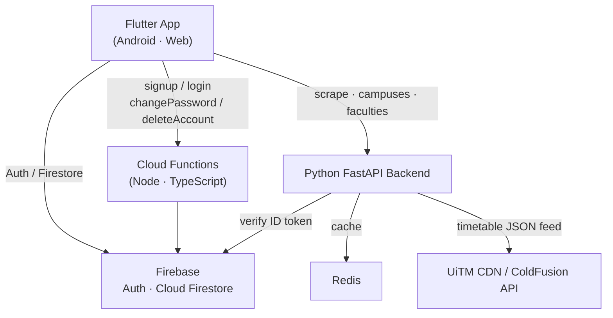
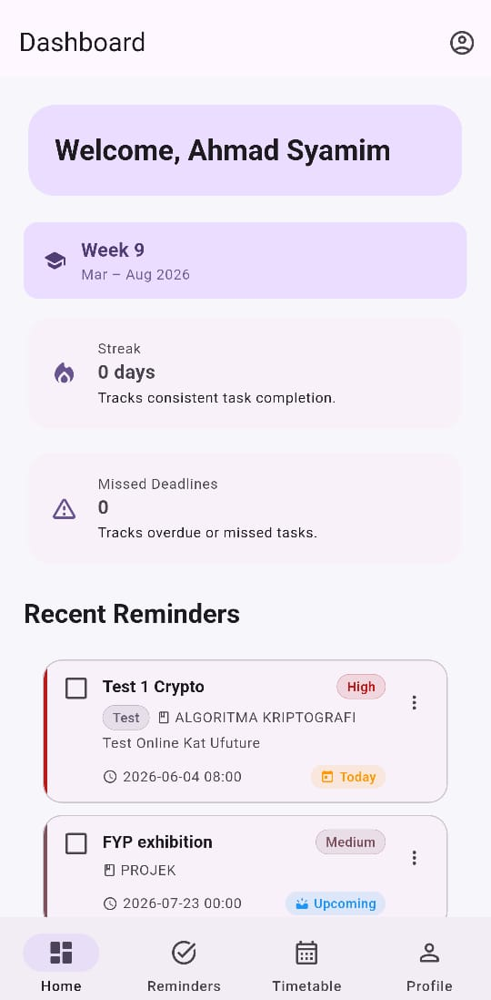
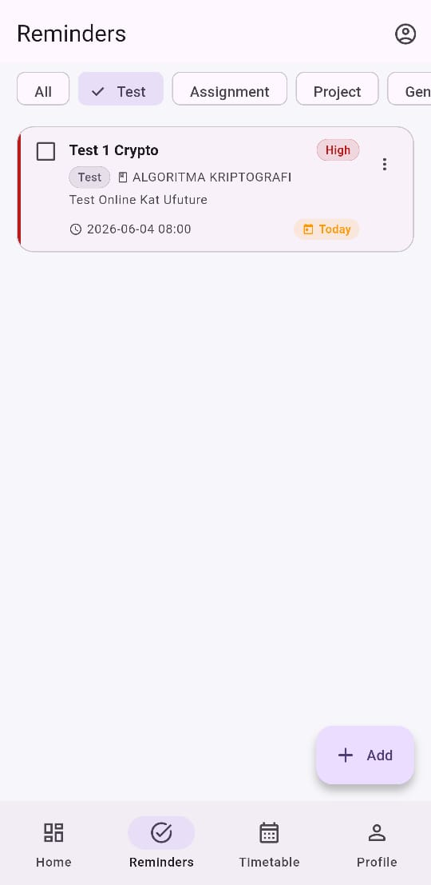
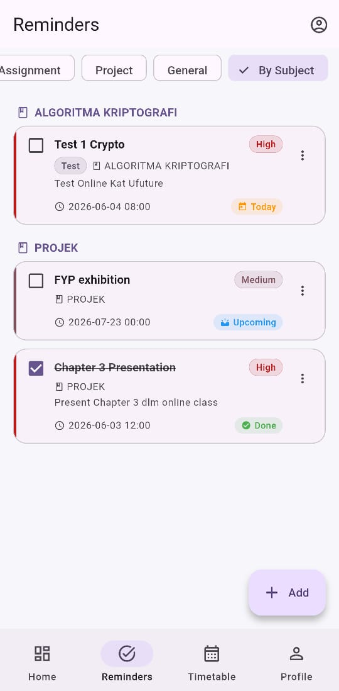
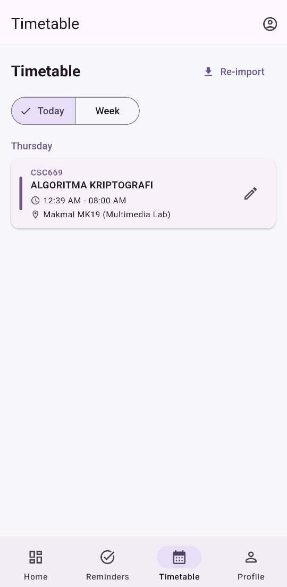
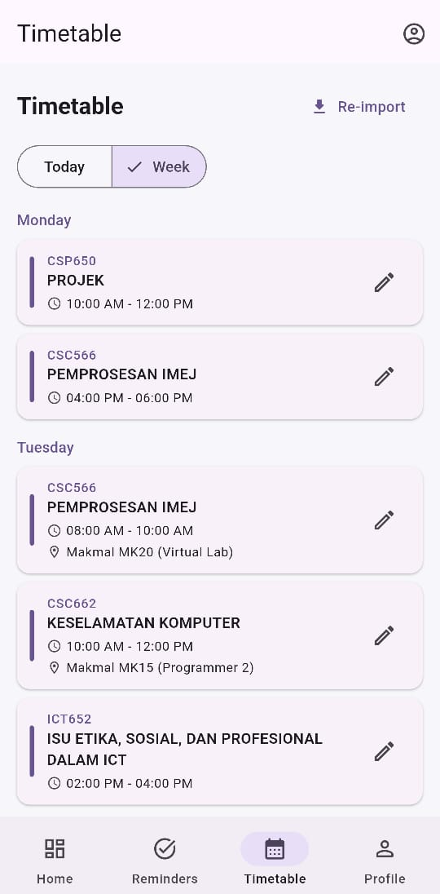
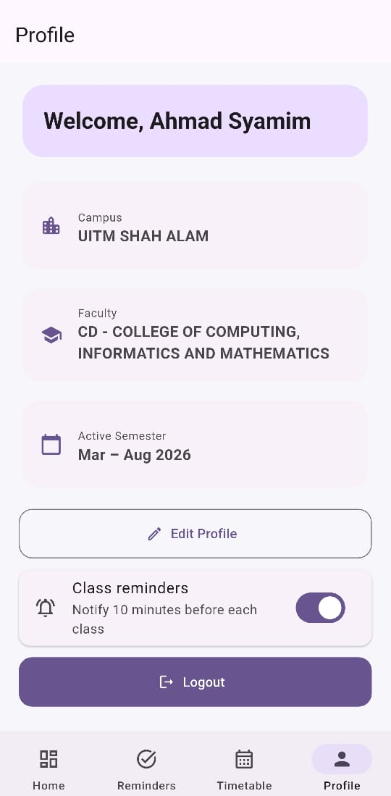

# Student Reminder System

A reminder and timetable manager for **UiTM (Universiti Teknologi MARA)** students. Import your class schedule in one tap, never miss a class or deadline, and stay on track with smart, timezone-aware notifications.

> Built with Flutter, Firebase, Cloud Functions, and a Python FastAPI backend.

---

## Overview

UiTM students juggle classes across campuses, faculties, and shifting semester phases — and manually copying a timetable into a calendar is tedious and error-prone. **Student Reminder System** solves this:

- **One-tap timetable import** — pull your real class schedule straight from UiTM's official feed using just your matric number.
- **Reminders that actually fire** — assignments, tests, and projects with priority, categories, recurrence, and configurable "early" alerts.
- **Reliable class alarms** — get notified 10 minutes before every class, even after a reboot, in the correct timezone.

The app is backed by a three-tier architecture: a Flutter client, Firebase (Auth + Firestore + Cloud Functions), and a self-hosted Python service that integrates with UiTM's timetable systems behind a Redis cache and per-user rate limiting.

---

## Architecture



| Tier | Responsibility |
| --- | --- |
| **Flutter app** | UI, local notifications, state, direct Firestore reads/writes for user data |
| **Cloud Functions** | Secure custom auth (bcrypt-hashed credentials, account deletion) |
| **Python FastAPI** | Timetable + campus/faculty integration with UiTM, Redis caching, rate limiting |

---

## Tech Stack

### Frontend (Flutter)
| Package | Purpose |
| --- | --- |
| `flutter` / `dart` (SDK ^3.11.5) | Cross-platform app (Material 3) |
| `flutter_riverpod` | State management |
| `go_router` | Navigation |
| `firebase_core` · `firebase_auth` · `cloud_firestore` · `cloud_functions` | Firebase integration |
| `google_sign_in` | Google Sign-In |
| `flutter_local_notifications` | Local + scheduled notifications |
| `timezone` · `flutter_timezone` | Timezone-correct scheduling |
| `http` | Calls to the Python backend |

### Auth & Data Backend
| Tech | Purpose |
| --- | --- |
| Firebase Authentication | Google Sign-In + custom-token auth |
| Cloud Firestore | Per-user reminders, timetable, profile, streaks |
| Cloud Functions (Node 24 / TypeScript) | signup, login, changePassword, deleteAccount |
| `bcryptjs` | Password hashing |

### Timetable Backend (Python)
| Tech | Purpose |
| --- | --- |
| FastAPI · `uvicorn` | REST API |
| Redis (`redis` asyncio) | Response caching |
| `firebase-admin` | Verifies Firebase ID tokens |
| Docker / docker-compose | Containerized deployment |

---

## Features

- **Authentication** — Google Sign-In and custom username/password (handled server-side via Cloud Functions with bcrypt hashing).
- **Reminders (full CRUD)**
  - Priority: Low / Medium / High
  - Categories: Test / Assignment / Project / General
  - Recurrence: None / Daily / Weekly / Monthly
  - Configurable early notifications (e.g. 1 day, 7 days before due)
  - Mark complete; linked to subject code & semester
- **Timetable** — import directly from UiTM with your matric number; view classes by day/subject/room; edit imported entries.
- **Notifications** — exact-alarm scheduling (with inexact fallback), 10-minute pre-class alerts, timezone-aware, re-armed automatically after device reboot.
- **Daily streak tracking** — keeps a completion streak to encourage consistency.
- **Profile** — set campus, faculty, semester, and program group (loaded dynamically from the backend).
- **Account management** — change password and full account deletion.
- **UiTM semester engine** — group-aware academic calendar that surfaces the current semester phase.

---

## Engineering Highlights

These are the parts worth a closer look.

### Timetable integration (web data fetching + parsing)
`backend/scraper.py` fetches a student's timetable from UiTM's official JSON feed (`cdn.uitm.link`) using only their matric number, then parses the raw day-by-day payload into clean, structured subject/class data the app can use. Campus and faculty lists are proxied from UiTM's ColdFusion (`.cfc`) endpoint in `backend/main.py`. Upstream failures map to precise HTTP statuses (`404 student_not_found`, `503 iCRESS_unavailable`, `502 parse_error`).

### Redis caching
`backend/cache.py` wraps every expensive upstream call in an async Redis cache with tiered TTLs — 6h for timetables (can change mid-semester) and 24h for near-static campus/faculty data. The cache is **fail-open**: any Redis error logs a warning and falls through to the live source instead of breaking the request.

### Per-user rate limiting
`backend/rate_limit.py` is a FastAPI dependency implementing a Redis fixed-window limiter keyed by Firebase UID (`INCR` + `EXPIRE`). Each route sets its own budget — e.g. `scrape` allows 10 req/60s, `campuses`/`faculties` 30 req/60s — returning `429 rate_limited` when exceeded. Also fail-open if Redis is down.

### Secure custom authentication
Cloud Functions (`functions/src/auth/`) handle signup, login, password change, and account deletion. Credentials are bcrypt-hashed and stored in server-only Firestore collections (`credentials`, `loginAttempts`) that clients can never read — enforced by `firestore.rules`. Account deletion fully removes the user's auth record and data.

### Reliable notification scheduling
`lib/core/notifications/` schedules notifications with `zonedSchedule()` and `TZDateTime` for timezone correctness, prefers Android exact alarms (`exactAllowWhileIdle`) with an inexact fallback, and registers a boot receiver so reminders survive a device restart. Separate channels isolate due reminders, class reminders, and debug output.

### Per-user data isolation
`firestore.rules` scopes every read/write to the authenticated user's own document subtree, so one user can never access another's reminders or timetable.

---

## Project Structure

```
student_reminder_system/
├── lib/                       # Flutter app
│   ├── main.dart              # Entry point, Firebase + notifications init
│   ├── core/
│   │   ├── semester_engine.dart      # UiTM academic calendar phases
│   │   ├── notifications/            # Scheduling, channels, tap routing
│   │   └── api/timetable_api.dart    # Calls to Python backend
│   └── features/             # auth, dashboard, reminders, timetable, profile, streak
├── functions/                # Cloud Functions (TypeScript)
│   └── src/auth/             # signup, login, changePassword, deleteAccount, validation
├── backend/                  # Python FastAPI service
│   ├── main.py               # API routes (scrape, campuses, faculties, health)
│   ├── scraper.py            # UiTM timetable fetch + parse
│   ├── cache.py              # Redis caching (fail-open)
│   ├── rate_limit.py         # Per-UID rate limiting
│   ├── auth.py               # Firebase ID-token verification
│   ├── docker-compose.yml    # Redis + backend
│   └── DEPLOY.md             # Production deploy guide
├── firestore.rules           # Per-user security rules
└── pubspec.yaml              # Flutter dependencies (v1.0.0+1)
```

---

## Setup

### Prerequisites
- [Flutter SDK](https://docs.flutter.dev/get-started/install) (Dart ^3.11.5)
- Node.js 24 + [Firebase CLI](https://firebase.google.com/docs/cli)
- Python 3.11+
- Redis (optional locally — the backend runs fail-open without it)
- A Firebase project with Authentication, Firestore, and Cloud Functions enabled

### 1. Flutter app
```bash
flutter pub get
flutter run
```
Firebase config lives in `lib/firebase_options.dart` and `android/app/google-services.json`. To target your own Firebase project, regenerate them with the FlutterFire CLI:
```bash
dart pub global activate flutterfire_cli
flutterfire configure
```

### 2. Cloud Functions
```bash
cd functions
npm install
npm run build
firebase deploy --only functions
```

### 3. Python timetable backend
```bash
cd backend
python -m venv .venv
source .venv/bin/activate
pip install -r requirements.txt

cp .env.example .env   # set GOOGLE_APPLICATION_CREDENTIALS, ALLOWED_ORIGINS, REDIS_URL
```
Run it directly:
```bash
uvicorn main:app --host 127.0.0.1 --port 8000
```
…or with Docker (brings up Redis + backend together):
```bash
docker compose up --build
```
The service exposes:
| Method | Route | Limit |
| --- | --- | --- |
| `POST` | `/api/timetable/scrape` | 10 / 60s |
| `GET` | `/api/campuses` | 30 / 60s |
| `GET` | `/api/faculties?campus=...` | 30 / 60s |
| `GET` | `/health` | — |

All API routes require a Firebase ID token (`Authorization: Bearer <token>`). For production deployment (Cloudflare Tunnel + systemd), see [`backend/DEPLOY.md`](backend/DEPLOY.md).

---

## Screenshots

| Home | Reminders (by category) | Reminders (by subject) |
| --- | --- | --- |
|  |  |  |

| Timetable (today) | Timetable (week) | Profile |
| --- | --- | --- |
|  |  |  |

---

## Deployment

The Python timetable backend is **self-hosted** — it runs via Docker Compose on a personal Debian home server, exposed to the app through a Cloudflare Tunnel (see [`backend/DEPLOY.md`](backend/DEPLOY.md)). Firebase Auth, Firestore, and Cloud Functions run on Google Cloud.

---

## Status

- **Android** — fully functional and tested.
- **Web / iOS** — configured but not fully tested.
- **Semester calendar** — UiTM session 2025/2026 is currently hardcoded in `lib/core/semester_engine.dart`; future sessions need updating.
